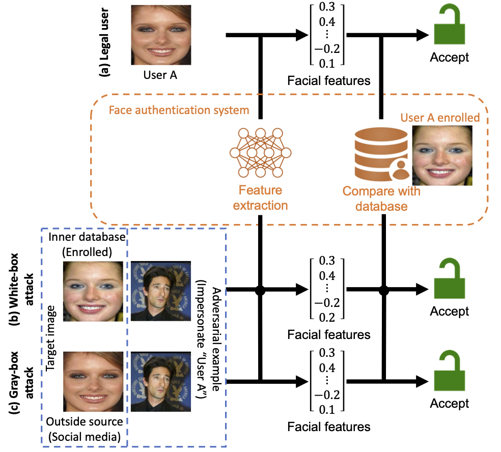
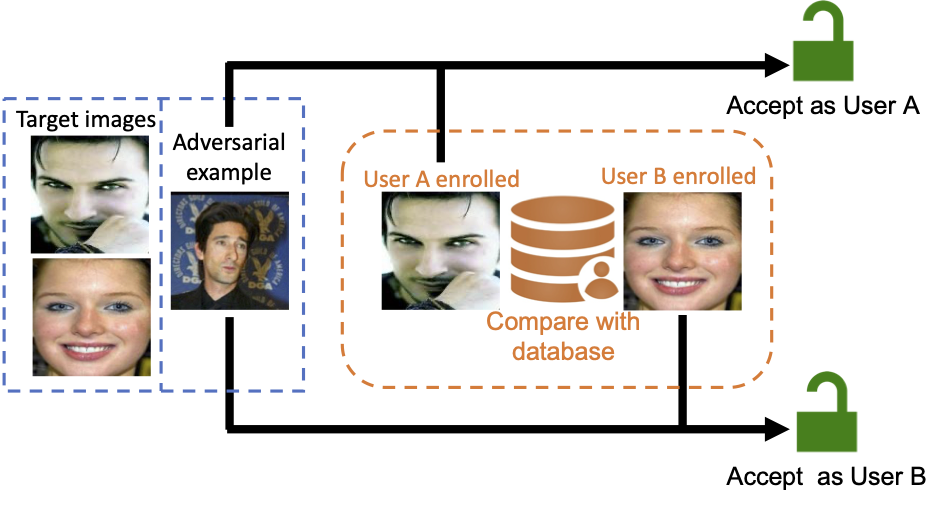
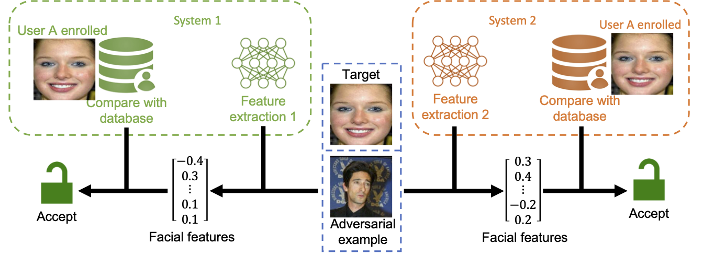
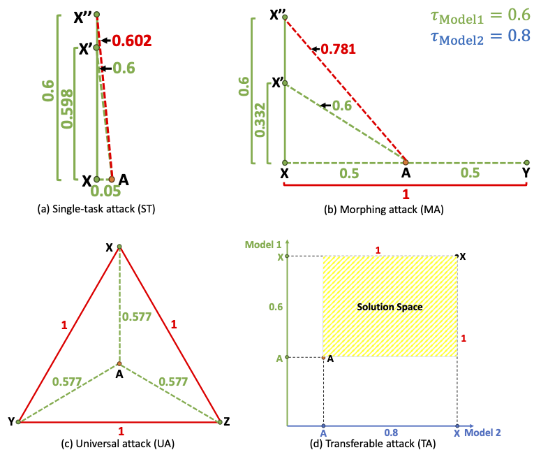

# A Multi-task Adversarial Attack Against Face Authentication

Hanrui Wang, Shuo Wang, Cunjian Chen, Massimo Tistarelli, Zhe Jin
 
[PDF]()

Deep-learning-based identity management systems, such as face authentication systems, are vulnerable to adversarial attacks. However, existing attacks are typically designed for single-task purposes, which means they are tailored to exploit vulnerabilities unique to the individual target rather than being adaptable for multiple users or systems. This limitation makes them unsuitable for certain attack scenarios, such as morphing, universal, transferable, and counter attacks. In this paper, we propose a multi-task adversarial attack algorithm called MTADV that are adaptable for multiple users or systems. By interpreting these scenarios as multi-task attacks, MTADV is applicable to both single- and multi-task attacks, and feasible in the white- and gray-box settings. Importantly, MTADV retains its feasibility as a single-task attack targeting a single user/system. To the best of our knowledge, MTADV is the first adversarial attack method that can target all of the aforementioned scenarios in one algorithm.

* The [single-task](https://github.com/azrealwang/SGADV/) adversarial attacks against face authentication.


* The multi-task adversarial attack impersonating multiple users.


* The multi-task adversarial attack attacking multiple systems.


* Geometric proof of the feasibility of MTADV in various attack scenarios.


****
## Contents
* [Main Requirements](#Main-Requirements)
* [Data Preparation](#Data-Preparation)
* [Pretrained Models](#Pretrained-Models)
* [Usage](#Usage)
* [Results](#Results)
* [Citation](#Citation)
* [Acknowledgement](#Acknowledgement)
* [Contacts](#Contacts)
****

## Main Requirements

  * **Python (3.9.13)**
  * **torch (1.13.1+cu116)**
  * **torchvision (0.14.1+cu116)**
  * **eagerpy (0.30.0)**
  
  The versions in `()` have been tested.

## Data Preparation

Source image name must satisfy `00000_0.jpg`. `00000` and `_0` indicates the image id and user id/class/label, respectively. The image id must be unique and auto-increment from `00000`. `.jpg` can be any image file format.

20 source samples have been prepared for the [demo](#Usage).

## Pretrained Models

* [InsightFace](https://github.com/deepinsight/insightface): iresnet100 pretrained using the CASIA dataset; automatically downloaded

* [FaceNet](https://github.com/timesler/facenet-pytorch): InceptionResnetV1 pretrained using the VggFace2 dataset; automatically downloaded

## Usage
Run single-task attack (MTADV-ST):

```
python MTADV_ST.py
```

Run morphing attack (MTADV-MA):

```
python MTADV_MA.py
```

* The universal attack (MTADV-UA) can use MTADV-MA attacking 50 targets.

Run transferable attack (MTADV-TA):

```
python MTADV_TA.py
```


* The counter attack (MTADV-CA) can replace one model in MTADV-TA by a defense model.

Benchmarking attacks: FGSM.py, DeepFool.py, CW.py, PGD.py

Objective function: foolbox/attacks/gradient_descent_base.py

New developed tools: foolbox/utils.py

Filter objects of CelebA: tools/fetch_celebAhq.py

Feature embeddings and save to .mat: tools/feature_embedding.py

## Citation
If using this project in your research, please cite our papers.
```
@inproceedings{wang2021similarity,
  title={Similarity-based Gray-box Adversarial Attack Against Deep Face Recognition},
  author={Wang, Hanrui and Wang, Shuo and Jin, Zhe and Wang, Yandan and Chen, Cunjian and Tistarelli, Massimo},
  booktitle={2021 16th IEEE International Conference on Automatic Face and Gesture Recognition (FG 2021)},
  pages={1--8},
  year={2021},
}

@inproceedings{wang2021similarity,
  title={Similarity-based Gray-box Adversarial Attack Against Deep Face Recognition},
  author={Wang, Hanrui and Wang, Shuo and Jin, Zhe and Wang, Yandan and Chen, Cunjian and Tistarelli, Massimo},
  booktitle={2021 16th IEEE International Conference on Automatic Face and Gesture Recognition (FG 2021)},
  pages={1--8},
  year={2021},
}
```

## Acknowledgement
* The code in the folder *foolbox* is derived from the project [foolbox](https://github.com/bethgelab/foolbox).

* Images in the folder *data* are only examples from [LFW](http://vis-www.cs.umass.edu/lfw/) and [CelebA](https://mmlab.ie.cuhk.edu.hk/projects/CelebA.html) dataset.

## Contact
If you have any questions about our work, please do not hesitate to contact us by email.

Hanrui Wang: hanrui_wang@nii.ac.jp
